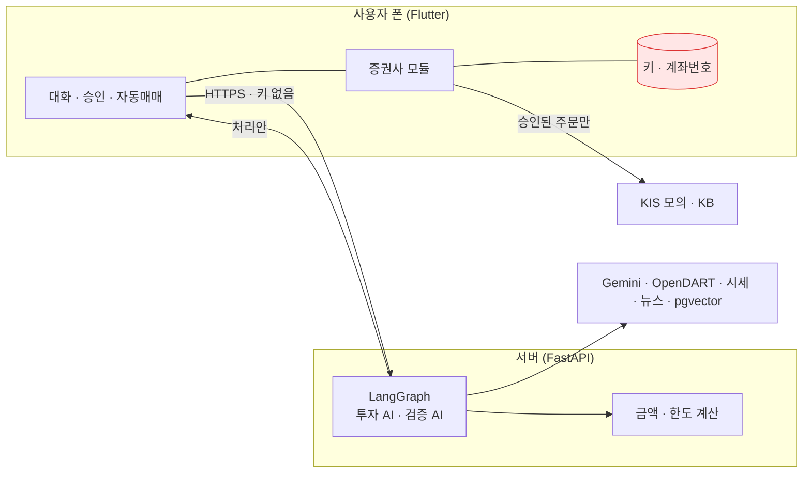

# 자연어 투자 에이전트

> "SK하이닉스 4주 사줘", "삼성전자 사도 돼?"처럼 말로 하면 **투자 AI가 제안하고 → 검증 AI가 원문을 다시 확인하고 → 사용자가 승인한 주문만 사용자 폰에서** 증권사로 나가는 앱.

LLM이 돈을 다룰 때 생기는 문제(지어낸 숫자, 근거 없는 확신, 키 유출, 사용자가 모르는 주문)를 **구조로 막는 것**이 중심이다.

| 지표 | 결과 |
|---|---|
| 모의 자동매매 하루 (10/8, 사람 개입 없음) | 매수 4,727,750원 → **−1.52%**, 같은 날 코스피 **−2.62%** |
| 검증 AI 오류 주입 (틀린 제안 20개, 3회) | 평균 **19.3/20** 차단, 멀쩡한 제안 30개 중 오탐 **0** |
| 요청 이해 골든 세트 | **77/77** 문장, 248항목 정답 (중앙값 1.6초) |
| 성향 신호 파인튜닝 (Qwen2.5-1.5B LoRA) | 정확도 34% → **83%**, 위험 놓침 **0.4%** (Gemini와 같음), 4배 빠름 |
| 백테스트 (1년, 생존 편향 제거) | 앱 규칙 **+36.7%** vs 동일 비중 +29.8% |

`Python · FastAPI · LangGraph · Gemini · PostgreSQL/pgvector · Flutter · KIS 모의투자 API · KB증권 Open API` · 테스트 서버 289 / 앱 32

---

## 1. 실제로 돌려 본 결과: 10/8 모의 자동매매

KIS 모의계좌(1,000만 원)로 장 시작부터 마감까지 앱이 **사람 손 없이** 종목 선정 → 투자 AI 제안 → 검증 AI 확인 → 한도 검사 → 주문까지 했다.

### 성과

| 종목 | 수량 | 평균 매입가 | 종가 | 평가손익 | 종목 등락 | 동종 업종 평균 |
|---|---|---|---|---|---|---|
| 현대건설 | 22 | 106,700 | 106,800 | **+2,200 (+0.09%)** | −3.70% | 건설 −4.10% |
| NH투자증권 | 93 | 25,595 | 24,800 | **−73,950 (−3.11%)** | −6.59% | 증권 −3.19% |
| **합계** | | | | **−71,750 (−1.52%)** | | 코스피 −2.62% |

- 계좌 전체 기준 −0.72%. 종가 기준 **미실현** 손익이다 (10/9 휴장, 매도는 10/12)
- 우리는 매수 시점(09:26~09:31)부터 종가까지, 코스피는 전일 종가 대비라 기간이 다르다. 참고용 비교다
- 출처: KIS 모의투자 일별 시세·잔고, 서버 DB의 제안서·검증·주문 기록

### 원인 분석 (손실 −71,750원)

| 원인 | 숫자 | 시스템이 봤나 |
|---|---|---|
| 시장 전체 급락 | 코스피 −2.62%, 3거래일 −5.4%, 외국인 −2.4조·기관 −1.9조 순매도 | ❌ 지수·수급 데이터 없음 |
| NH투자증권 업종 악재 | 증권 평균보다 −3.4%p 더 빠짐. 당일 아침 실적 우려·목표주가 4만→3.4만 원 | ❌ 뉴스 없음 |
| 장중 하락을 보고도 매수 | 09:27에 이미 −3.39%. 투자 AI가 반대 근거로 적고도 매수 | ✅ 봤지만 "사용자 지시"로 처리 |
| 선정 기준에 수익 신호 없음 | "최근 공시 순"으로 고름. 현대건설은 한 달 −18% 하락 추세 | ❌ 추세 안 씀 |
| 하루 늦은 가격 | 아침 분석이 10/6 종가(112,900원) 사용 | ❌ |
| (운) 늦게 사서 덜 잃음 | 버그로 20분 늦게 매수. 시가였다면 약 −11만 원 더 (추정) | — |

**결론**: 주문 과정(근거 확인·한도·중복 방지)은 설계대로 작동했고, 틀린 숫자로 나간 주문은 0건이다. 하지만 **무엇을 언제 살지 정하는 전략에 수익 근거가 없었다**. 손실은 거의 시장 분위기와 한 종목의 업종 악재로 설명된다.

### 그날 사고 5건과 조치

| 시각 | 사고 | 조치 |
|---|---|---|
| 09:05 | 매수 2건 서버 거부 (새 입력 칸이 검사 모델에 빠짐) | 15분 만에 수정, 테스트 추가 |
| 09:20 | 실패 종목을 "오늘 끝"으로 기록 | 하루 3번 재시도, 산 수량은 빼고 계산 |
| 09:27 | KIS 초당 호출 제한으로 주문 실패 | 2초 뒤 최대 3번 재전송 → 09:30 체결 |
| 15:00 | 잔고 조회 12.5초 > 제한 10초, 자동 매도 시작 못 함 | 제한 30초, 조회 성공 뒤에만 "매도함" 기록 |
| 15:21 | 위험을 줄이는 매도까지 한도에 막힘 | 매도는 한도에서 빼고 1회 한도 안으로 나눠 팔기 |

### 분석으로 바꾼 것

| 원인 | 바꾼 것 |
|---|---|
| 장중 하락을 보고도 매수 | 자동 주문을 사용자 지시와 구분, 투자 AI가 "관찰"로 거절 가능 |
| 뉴스 없음 | Google 뉴스 RSS(무료)를 출처로, 악재는 반대 근거로 |
| 보유 중 급락 | 장중 −3% 하락 시 AI가 매도 판단 (종목당 하루 3번) |
| 매도가 막힘 | 매도도 매일 아침 사용자 승인, 나눠 팔기 |
| 선정 기준 근거 없음 | 백테스트로 규칙 검증 (3장) |

전체 리포트: [docs/reports/2026-10-08-mock-auto-trading.html](docs/reports/2026-10-08-mock-auto-trading.html)

## 2. 검증 AI가 틀린 제안을 거르나

투자 AI가 실제로 쓴 제안서 10개에 일부러 오류 20종을 넣었다. 숫자 ×3, 없는 출처, 증가↔감소 뒤집기, 출처에 없는 계약 주장, "무조건 오른다", 고령·안정형에게 몰빵 매수 등이다.

| 단계 | 차단 | 바꾼 것 |
|---|---|---|
| 처음 | 15/20 | — |
| 코드 검사 보강 | 19/20 | 출처 종목 대조, 금액 단위·크기 대조, "위험·비용 없다" 문구 검사 |
| 검증 AI 지시 수정 | **18 · 20 · 20 (평균 19.3)** | 코드 경고를 원문과 다시 대조, 설명 못 하면 승인 안 함 |

- 오류를 넣지 않은 원래 제안서 30개는 **모두 승인** (오탐 0)
- 평가 중 **투자 AI의 실제 실수**도 찾았다: "78조 9,548조 원" 단위 오류는 첫 평가 때 검증 AI가 승인했지만 지금은 코드가 막는다
- 아직 가끔 놓침: 말이 안 되는 수치("상위 240%"), 출처에 없는 계약 주장 (각 3회 중 1회)

전체: [docs/reports/evaluation-20261010.md](docs/reports/evaluation-20261010.md) (정답·오류 사례는 Claude가 만들었다)

## 3. 백테스트 (2025-10 ~ 2026-10, 235거래일)

매일 그날 기준 시가총액 상위 150종목을 다시 골라 **생존 편향**을 뺐다. 미래 정보를 쓰지 않는지 테스트로 확인했고, 왕복 비용 0.23%를 반영했다.

| 전략 | 그날 기준 대상 | 오늘 살아남은 종목만 (편향) |
|---|---|---|
| 동일 비중 (기준) | +29.8% | +76.4% |
| **앱 브리핑 규칙** | **+36.7%** | +57.4% |
| 모멘텀 (5일 상승 상위 3) | −64.6% | +134.0% |
| 역추세 (5일 하락 상위 3) | −47.7% | +67.9% |

같은 모멘텀 전략이 편향 때문에 −64.6%에서 +134.0%로 부풀려진다. 과거 결과는 미래를 보장하지 않는다.

## 4. 성향 신호 파인튜닝

퀴즈 규칙은 "다음 달 방 빼야 하는데 그 돈 굴려볼까" 같은 말을 못 본다. 그래서 문장에서 위험 신호 6종(생활비·빌린 돈·급등 추격·공포 매도·몰빵·없음)을 고르는 모델을 학습했다.

| 방법 | test (293) | hard (57) | 위험 놓침 | 문장당 |
|---|---|---|---|---|
| 키워드 규칙 | 49.5% | 24.6% | 40.3% | 0ms |
| Gemini 프롬프트 | 92.2% | 100% | 0.4% | 1,335ms |
| **Qwen2.5-1.5B LoRA** | 33.8% → **83.3%** | 36.8% → **96.5%** | **0.4%** | **303ms** |

- 가상 문장 1,500개로 학습했고, 학습과 시험은 말투로 분리했다. RTX 5060 Ti에서 몇 분 걸렸고 GPU 메모리를 16GB에서 3.7GB로 줄였다
- 신호는 투자 AI 참고와 처리안 경고에만 쓴다. 검증 AI에는 주지 않는다. **실제 사용자 정확도는 미확인**이다

## 5. 설계

| 원칙 | 구현 |
|---|---|
| 서버는 증권사 키를 모른다 | 키는 폰 보안 저장소에만. 서버는 처리안까지, 주문은 폰이 직접 |
| 모든 주문은 3단계 | 투자 AI → 검증 AI → 사용자 승인. 자동매매·정정·취소도 같은 길 |
| 검증 AI는 독립적 | 결론 없이 제안·출처 ID만 받아 원문을 다시 읽고 판정 |
| 숫자는 코드가 | LLM은 분류·문장만. 금액·한도·수수료는 코드가 계산 |
| 기본은 모의투자 | 실전 모드는 직접 켜야 하고(모의 체결 10건·5일 이상), 실전 자동매매는 1회 30만 원 |



## 6. 실행

`apps/api/.env.example`을 `.env`로 복사해 키를 채우고, PostgreSQL(pgvector)을 띄운다.

```bash
uv --directory apps/api run python -m app.migrate
```

```bash
uv --directory apps/api run uvicorn app.main:app --port 8000
```

```bash
cd apps/client && flutter run --dart-define-from-file=dev_keys.env
```

```bash
uv --directory apps/api run pytest
```

## 7. 한계

- 모의 자동매매는 하루·두 종목이라 전략 판단에는 수십 거래일이 필요하다
- 시장 지수·수급 데이터를 아직 안 본다 (10/8 손실의 가장 큰 원인)
- KB증권 실전 연결은 실제 키로 확인 전이다. 실계좌 주문은 사람이 직접 한다

모의투자 결과이며 투자 권유가 아니다.
