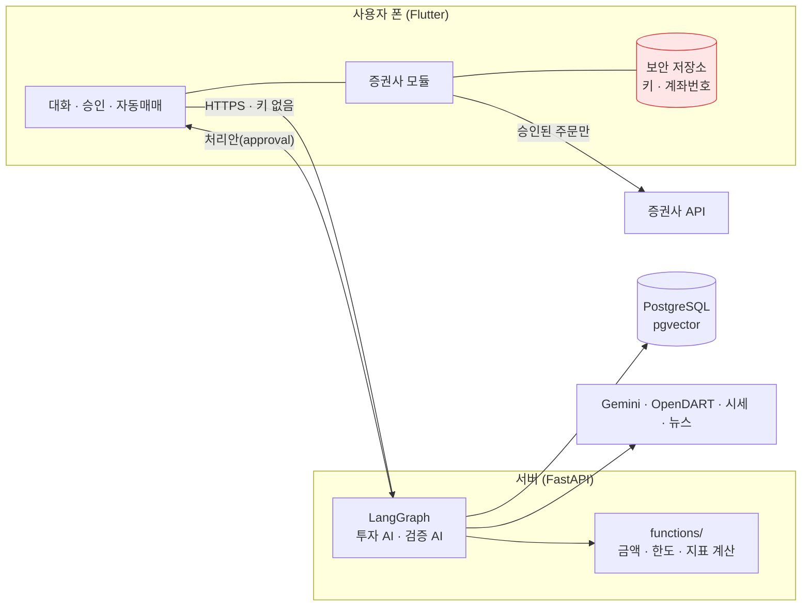

# 자연어 투자 에이전트

> "SK하이닉스 4주 사줘", "삼성전자 사도 돼?"처럼 말로 하면,
> **투자 AI가 제안하고 → 검증 AI가 원문을 다시 확인하고 → 사용자가 승인한 주문만 사용자 폰에서** 증권사로 나가는 앱.

LLM이 돈을 다루는 일에 끼어들 때 생기는 문제(환각 숫자, 근거 없는 확신, 키 유출, 사용자가 모르는 주문)를 **구조로 막는 것**이 이 프로젝트의 중심이다.

| | |
|---|---|
| 서버 | Python · FastAPI · LangGraph · Gemini · PostgreSQL + pgvector |
| 앱 | Flutter (Android · Web) |
| 증권사 | KIS 모의투자 (주문·정정·취소·체결), KB증권 (실전 연결 준비 중) |
| 데이터 | OpenDART 공시(본문 임베딩 RAG), 공공데이터 시세, Google 뉴스 RSS |
| ML | Qwen2.5-1.5B LoRA 파인튜닝 (대화 속 성향 신호) |
| 테스트 | 서버 pytest 287개, Flutter 30개 |

---

## 1. 안전 설계: 왜 이렇게 만들었나

| 원칙 | 구현 |
|---|---|
| **서버는 증권사 키를 모른다** | 앱키·시크리트·계좌번호는 폰 보안 저장소에만 있다. 서버는 "처리안"까지만 만들고, 실제 주문은 폰이 `execute` 멈춤을 받아 직접 낸다. 웹에는 주문 기능이 없다 |
| **모든 주문은 3단계** | 투자 AI 제안 → 검증 AI 확인 → 사용자 승인. 사용자가 직접 지시한 주문과 자동매매 주문도 같은 길을 간다 (정정·취소 포함) |
| **검증 AI는 독립적이다** | 검증 AI는 투자 AI의 결론을 받지 않는다. 제안·근거·출처 ID만 받아 **원문(공시·시세)을 다시 읽고** 판정한다. 반박-수정은 최대 2번 |
| **숫자는 코드가 만든다** | LLM은 분류·값 뽑기·문장만 한다. 금액·비중·수수료·세금·한도 검사는 `functions/`의 코드가 계산한다 |
| **조심하는 쪽으로만** | 성향(퀴즈·매매 습관·대화 신호)은 위험한 주문을 막거나 한 번 더 확인받는 데만 쓴다. 한도를 올리지 않는다 |
| **기본은 모의투자** | 실전 모드는 설정에서 직접 켜야 하고, 켜져 있는 동안 화면에 빨간 표시가 항상 있다. 고액 실전 주문은 한 번 더 확인하고, 긴급 중단 버튼이 있다 |
| **출처와 기준 시각** | 가격·공시·뉴스에는 출처와 기준 시각을 붙이고, 확인 못 한 것은 `미확인`으로 쓴다 |



## 2. 대화가 주문이 되기까지 (LangGraph)

```
사용자 말 → rewrite("그거" 풀기) → classify
  ├ 조회   잔고 · 시세 · 주문 내역 (폰에 fetch 요청 → 폰이 증권사에서 읽어 옴)
  ├ 분석   투자 AI 제안서(출처 ID) → 코드 검사 → 검증 AI(원문 다시 읽기) → 반박-수정 ≤2
  ├ 주문   종목 찾기 → 정정·취소 대상 고르기 | 예약·분할 → 계좌 → 가격 → 분석 → 정책 검사(코드)
  │        → 처리안(approval 멈춤) → 사용자 승인 → execute 멈춤 → 폰이 주문 → 체결 기록
  └ 결과   "이번 달에 뭐 샀지?" "왜 반려됐지?" → DB 기록으로 답
```

멈춤 4종류(`question` / `fetch` / `approval` / `execute`)는 LangGraph interrupt와 Postgres 체크포인트로 구현했다. 앱을 껐다 켜도 대화가 이어진다.

## 3. 기능

**대화·분석**
- 자연어 조회·분석·주문·기록 질문, SSE 스트리밍
- 공시 RAG: 코스피 100 + 코스닥 50 종목 정기·주요 공시 본문(표 포함)을 임베딩해 근거로 인용
- 무료 뉴스(Google 뉴스 RSS): 제목·링크만, 3일 이내, 종목명 필터
- 아침 브리핑, 장 마감 요약, AI 회고·내일 계획

**주문**
- 지정가·시장가, 정정·취소(일부 수량), 예약·조건부(가격 도달), 분할 주문
- 정책 검사: 1회·1일 한도, 계좌 크기 비례 한도(성향별 10~30%), 종목 비중 한도, 위험 등급, 가격 변동
- 행동 코치: 잦은 매매, 급등 직후 매수, 이익 종목만 매도 습관을 처리안에 경고

**자동매매 (모의, 앱이 켜져 있을 때)**
- 매일 아침 사용자가 그날 매수 금액과 매도 목록을 승인해야 시작
- 자동 주문도 투자 AI → 검증 AI → 한도 검사를 거침. 실행 후 알림, 긴급 중단
- 장중 급락(-3%) 시 AI가 매도할지 판단 (종목당 하루 3번까지)
- 실전 자동매매는 소액(1회 30만 원)만 허용하는 규칙까지 만들어 둠. 실전 주문 실행은 KB 주문 명세가 나오기 전까지 막혀 있음

**성향**
- 8문항 퀴즈 → 5단계 (투자 체력으로 상한, 상황 선택으로 단계, 지식 퀴즈로 감점). 퀴즈를 안 하면 정보만 주는 일반 모드
- 최근 30일 매매 기록으로 습관 파악 (규칙)
- 대화 속 위험 신호 감지 (파인튜닝 모델, 아래 4-3)

**포트폴리오**
- 비중, 쏠림 지수, 현금 비율 점검과 리밸런싱 제안 (주문은 만들지 않음)

## 4. 결과

### 4-1. 모의 자동매매 하루 (2026-10-08)

KIS 모의계좌 1,000만 원으로 하루 동안 자동매매를 돌렸다.

- 평가손익 **−71,750원 (−1.52%)**. 같은 날 코스피는 −2.62%
- 원인 분석: 시장 전체 급락, 매수 종목 업종 악재 뉴스, 장중 하락 중 매수(사용자 지시라 "관찰"로 바뀌지 않음), 수익률 신호 없는 종목 선택 규칙, 하루 늦은 시세 데이터
- 이 분석으로 고친 것:
  - 자동 주문은 투자 AI가 "지금은 관찰"이라고 판단할 수 있게 함
  - 뉴스를 추가함
  - 매도도 매일 승인받게 함
  - 장중 급락 시 AI가 매도를 판단하게 함
  - 결제 후 예수금으로 자산을 계산하게 함 (이중 계산 수정)
- 리포트: [docs/reports/2026-10-08-mock-auto-trading.html](docs/reports/2026-10-08-mock-auto-trading.html)

### 4-2. 백테스트 (2025-10 ~ 2026-10, 235거래일)

미래 정보를 쓰지 않는지(테스트로 확인)와 **생존 편향**을 따로 검사했다. 매일 왕복 비용 0.23%를 반영했다.

| 전략 | 그날 기준 대상 | 오늘 기준 대상 (생존 편향) |
|---|---|---|
| 대상 전체 동일 비중 (기준) | +29.8% | +76.4% |
| 앱 브리핑 규칙 (공시 최신순) | **+36.7%** | +57.4% |
| 5일 상승 상위 3 (모멘텀) | −64.6% | +134.0% |
| 5일 하락 상위 3 (역추세) | −47.7% | +67.9% |

같은 전략이라도 "지금 살아남은 종목"으로 돌리면 결과가 크게 부풀려진다(모멘텀 −64.6% → +134.0%). 과거 결과는 미래 수익을 보장하지 않는다. 전체: [docs/reports/backtest-20261009.md](docs/reports/backtest-20261009.md)

### 4-3. 성향 신호 파인튜닝

퀴즈와 매매 기록 규칙은 "다음 달 방 빼야 하는데 그 돈 굴려볼까", "친구한테 오백 꿔서 넣으려고" 같은 말을 못 본다. 그래서 사용자 문장 하나에서 위험 신호 6종을 고르는 작은 모델을 학습했다.
- 6종: 없음, 생활비, 빌린 돈, 급등 추격, 공포 매도, 몰빵

- **데이터**:
  - Gemini가 만든 가상 문장 1,500개 → 다른 Gemini 호출로 라벨을 다시 확인 → 다른 것은 학습에서 뺌
  - 학습과 시험은 **말투로 나눔**: 시험용 말투 2개는 학습에 쓰지 않음
  - 헷갈리는 문장 57개(hard)는 Claude가 따로 씀
- **학습**: Qwen2.5 Instruct(0.5B, 1.5B) + LoRA. 원본은 그대로 두고 작은 덧붙임 가중치만 학습했고, RTX 5060 Ti에서 3에폭 몇 분 걸렸다
  - 라벨 6개의 확률을 비교해 고르므로 엉뚱한 답이 나올 수 없음
  - 답 칸에서만 확률을 계산하고 중간 값을 다시 계산하게 해서(gradient checkpointing) GPU 메모리를 16GB에서 3.7GB로 줄임

| 방법 | test 정확도 | hard 정확도 | 위험 놓침 (test) | 오경보 (test) | 문장당 시간 | 비용 |
|---|---|---|---|---|---|---|
| 키워드 규칙 | 49.5% | 24.6% | 40.3% | 28.9% | 0ms | 0 |
| Gemini 프롬프트 | **92.2%** | **100%** | 0.4% | 0.0% | 1,335ms | 호출마다 |
| 0.5B 학습 전 → 후 | 17.1% → 78.2% | 12.3% → 73.7% | 1.2% | 11.1% | 120ms | 0 |
| **1.5B 학습 전 → 후 (기본값)** | 33.8% → **83.3%** | 36.8% → **96.5%** | **0.4%** | 13.3% | **303ms** | 0, 문장이 밖으로 안 나감 |

**정직한 해석**:
- 파인튜닝으로 1.5B 모델 정확도가 34% → 83%로 올랐다. 위험 신호를 놓치는 비율은 Gemini와 같고(0.4%), Gemini보다 4배 빠르고 무료다
- 모델을 0.5B → 1.5B로 키우니 사람이 쓴 hard 세트에서 74% → 97%로 크게 좋아졌다
- 하지만 **test 정확도는 아직 Gemini보다 낮고**, 신호 없는 문장에 경고하는 비율(오경보 13%)이 있다. 생활비를 공포 매도로 헷갈리는 일이 가장 많다
- 데이터와 test 라벨을 Gemini가 만들거나 확인했으므로 Gemini에 유리한 비교다. **모두 가상 문장이며 실제 사용자 정확도는 미확인**이다

앱에서는 `SIGNAL_MODEL_URL`을 설정해야 켜지고 기본은 꺼짐이다. 신호가 보이면 처리안에 경고를 더하고 한 번 더 확인받는다.

전체: [1.5B](docs/reports/signal-finetune-1.5B-20261010.md), [0.5B](docs/reports/signal-finetune-0.5B-20261010.md)

### 4-4. 평가: 말을 맞게 알아듣나, 검증 AI가 틀린 제안을 거르나

실제 Gemini와 실제 공시·시세로 돌렸다. 다시 돌리기: `uv run python -m app.evaluate golden|inject|demo|report`

- **요청 이해 골든 세트: 77/77 문장 전부 정답** (확인 항목 248개, 응답 중앙값 1.6초)
  - 조회, 분석, 주문(정정·취소·조건·분할), 기록, 용어, "그거" 풀기를 포함한다
  - "100만원어치"처럼 수량을 말하지 않으면 지어내지 않고 비워 두는지도 본다
- **검증 AI 오류 주입: 틀린 제안 20개 중 15개를 막음**
  - 투자 AI가 실제로 쓴 제안서 10개에 숫자 부풀리기, 없는 출처, 증가↔감소 뒤집기, 출처에 없는 계약·자사주 주장, "무조건 오른다", 고령·안정형에게 몰빵 매수 등을 넣었다
  - 코드 검사(출처·지표 ID, 빈 위험)로는 못 잡는 오류 15개 중 10개를 검증 AI가 원문을 다시 읽어 잡았다
  - **놓친 5개**:
    - 다른 종목 공시를 출처로 단 것
    - 억→조 단위 오류
    - 위험·반대 근거를 "없다"로 바꾼 것 (조건부 승인)
    - "수수료·세금 없다"
  - 다음 개선 대상: 출처 종목 대조, 위험 문구 코드 검사
  - 고치지 않은 원래 제안서 10개는 승인 9, 조건부 1로 반려되지 않았다
- **데모 시나리오 3개**: 분석 → 주문, 직접 주문, 자동매매 주문이 처리안과 폰 실행 요청까지 끝까지 돈다 (한 번에 10~14초)
  - 성향보다 위험한 주문은 "확인 필요"를 체크해야만 승인된다
  - 실제 모의 체결은 장중에 앱으로 확인한다

전체: [docs/reports/evaluation-20261010.md](docs/reports/evaluation-20261010.md). 골든 세트와 오류 사례를 Claude가 만들었다는 한계가 있다.

## 5. 폴더

```
apps/api/            서버
  app/agents/        LangGraph 그래프 (supervisor · 조회 · 분석 · 주문 · 결과), Gemini 호출은 llm.py 한 곳
  app/functions/     금액 · 한도 · 성향 · 습관 · 포트폴리오 계산 (AI 없음)
  app/routers/       REST API
  app/integrations/  OpenDART · 공공데이터 · Google 뉴스
  app/collect.py     시세 · 재무 · 공시 수집과 임베딩
  app/backtest.py    백테스트
  app/evaluate.py    평가 (골든 세트 eval/golden.jsonl · 검증 AI 오류 주입 · 데모)
  app/signals.py     대화 속 성향 신호 (키워드 · Gemini · 학습 모델)
  migrations/        DB SQL (번호 순서)
  tests/             pytest (DB invest_test, Gemini는 가짜로 바꿔 끼움)
apps/client/         Flutter 앱
  lib/broker/        증권사 모듈 (KIS 모의 · KB(준비 중) · 가짜)
  lib/features/      채팅 · 승인 · 자동매매 · 기록 · 설정 · 홈
apps/finetune/       성향 신호 모델 학습 · 평가 · 로컬 서빙 (서버와 따로 설치)
docs/plan/           기획 · 요구사항 · 아키텍처 · 그래프 · DB · 진행 기록
docs/reports/        모의 자동매매 · 백테스트 · 파인튜닝 결과
```

## 6. 실행

준비물: Docker Desktop, [uv](https://docs.astral.sh/uv/), Flutter

```bash
docker run -d --name invest-db -e POSTGRES_PASSWORD=<비밀번호> -e POSTGRES_DB=invest -p 5432:5432 -v invest-pgdata:/var/lib/postgresql pgvector/pgvector:pg18
```

`apps/api/.env.example`을 `apps/api/.env`로 복사해 `DATABASE_URL`, `GEMINI_API_KEY`, `OPENDART_API_KEY`, `DATA_GO_KR_API_KEY`를 채운다.

```bash
uv --directory apps/api run python -m app.migrate
```

```bash
uv --directory apps/api run python -m app.collect
```

```bash
uv --directory apps/api run uvicorn app.main:app --port 8000
```

앱 (Android 에뮬레이터, 증권사 개발 키는 `apps/client/dev_keys.env`, 양식은 `dev_keys.example.env`. 키가 없으면 가짜 증권사):

```bash
cd apps/client && flutter run --dart-define-from-file=dev_keys.env
```

성향 신호 모델 (선택, NVIDIA GPU 필요):

```bash
cd apps/finetune && uv sync && uv run python train.py && uv run python serve.py
```

## 7. 테스트

```bash
uv --directory apps/api run pytest
```

```bash
cd apps/client && flutter test
```

- 서버 테스트는 `invest_test` DB를 새로 만들어 쓰고, Gemini·뉴스·신호 모델은 가짜로 바꿔 끼운다(비용 0).
- 실제 Gemini 확인은 `pytest -m gemini`로 돌리며 비용이 든다.

## 8. 한계와 다음 할 일

- **실전 주문은 아직 안 나간다**: KB증권 주문 명세가 공개 예제에 없어 실전 모드 주문은 막혀 있다. 실계좌 테스트는 사람이 직접 한다
- **공개 배포 전 법률 확인 필요**: 투자자문업 해당 여부 등 질문을 [docs/plan/13-legal-check.md](docs/plan/13-legal-check.md)에 정리했다
- **푸시 알림**: 코드는 있고, Firebase 설정 파일을 넣으면 켜진다
- **검증 AI가 놓치는 오류**: 다른 종목 출처, 단위 오류, '위험 없다'류 문구를 코드 검사로 보강해야 한다
- **성향 신호 모델**: 실제 사용자 문장(동의·익명화)으로 다시 학습·평가해야 한다. 지금 수치는 가상 문장 기준이다
- **백테스트**: 공시는 지금 대상 종목만 있어 생존 편향이 일부 남아 있다

## 문서

- [INVEST_AGENT_PLAN.md](INVEST_AGENT_PLAN.md): 기획서
- [AGENTS.md](AGENTS.md): 작업 규칙 (사람과 AI 에이전트 공통)
- [docs/plan/PROGRESS.md](docs/plan/PROGRESS.md): 진행 상황
- [docs/plan/12-todo-by-stage.md](docs/plan/12-todo-by-stage.md): 단계별 할 일
- [docs/plan/04-graph-design.md](docs/plan/04-graph-design.md): 그래프 설계
- [docs/plan/09-investor-profile.md](docs/plan/09-investor-profile.md): 성향 퀴즈 설계와 근거

본 앱의 정보는 투자 권유가 아니며, 모든 투자 판단과 손실 책임은 사용자에게 있다.
